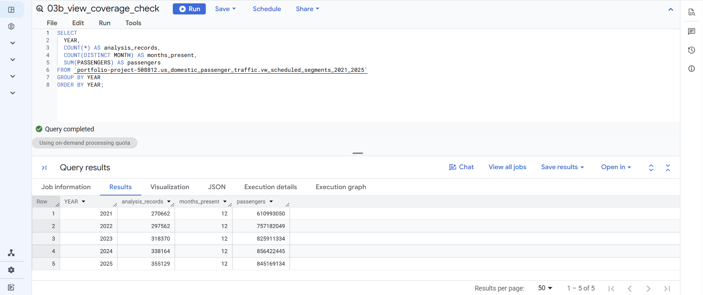
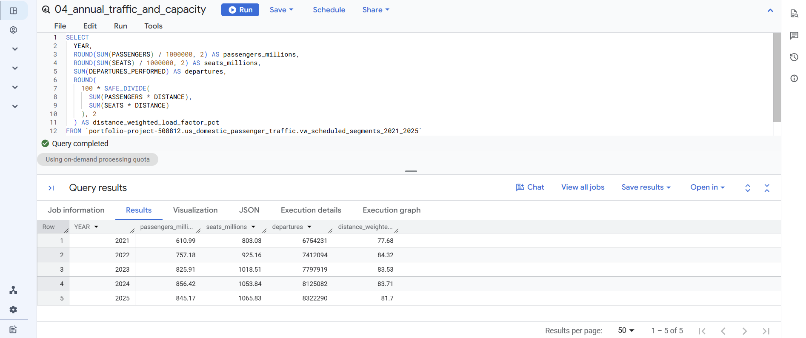
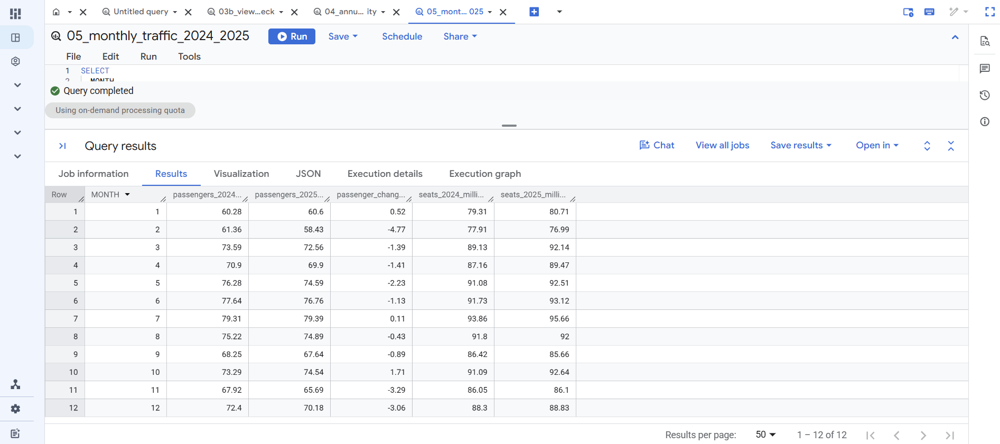
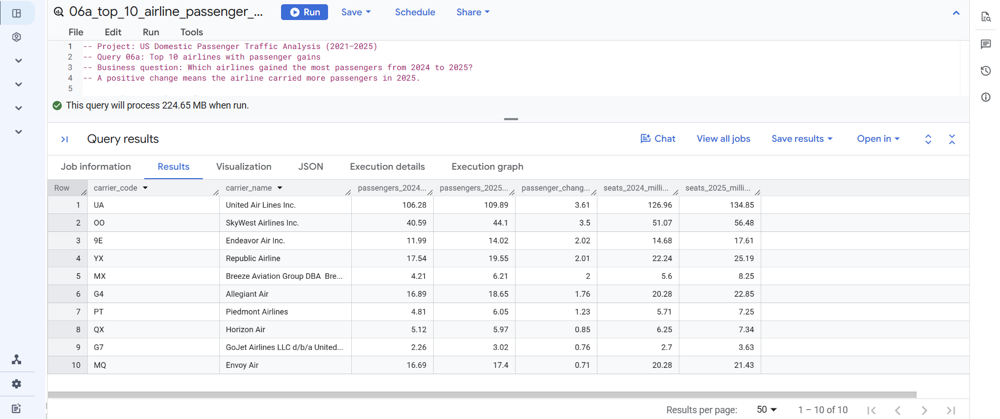
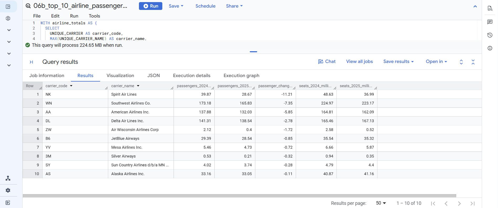
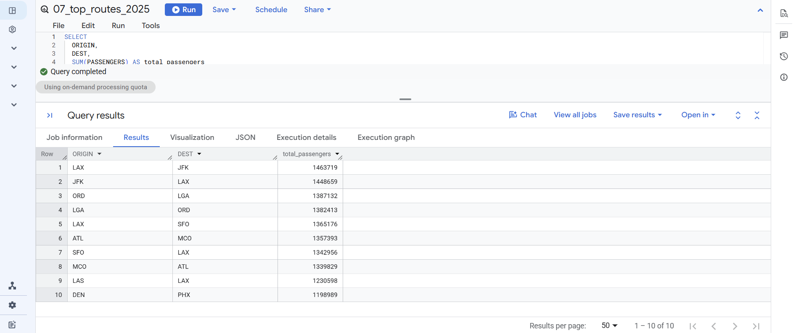
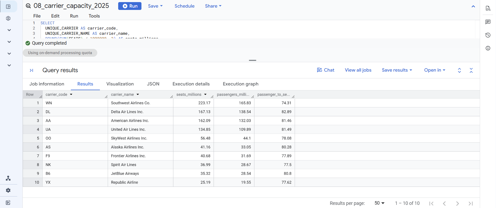
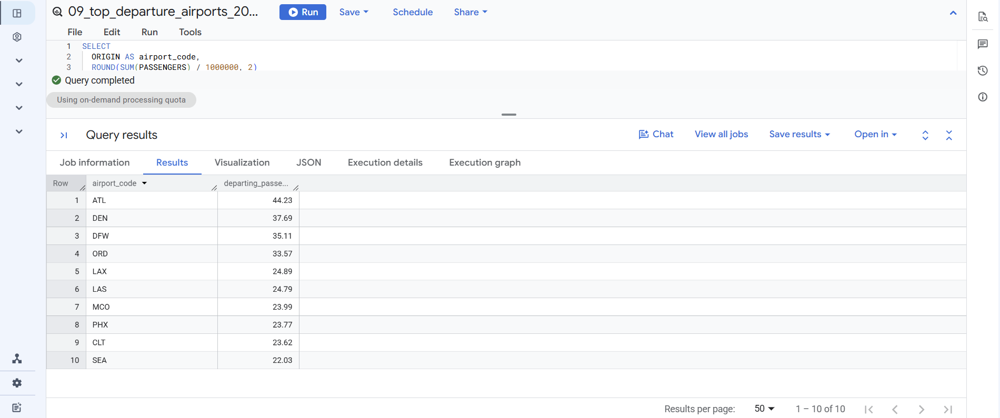

# US Domestic Passenger Traffic Analysis (2021–2025)

An SQL portfolio project examining U.S. domestic scheduled passenger traffic using the Bureau of Transportation Statistics (BTS) T-100 Domestic Segment data. Five annual CSV extracts were loaded into Google BigQuery to study passenger demand, offered seats, departures, airlines, routes, and departure airports.

## Executive summary

Recorded segment passengers rose from **610.99 million in 2021** to **856.42 million in 2024**, then fell to **845.17 million in 2025**. Offered seats and performed departures continued to rise in 2025, while the distance-weighted load factor declined from **83.71% to 81.70%**. This mismatch between rising capacity and declining demand in 2025 suggests potential overcapacity. These results describe traffic and capacity; the source does not establish why demand changed.

## Business questions

1. How did passengers, seats, departures, and utilization change from 2021 through 2025?
2. How did passenger traffic vary by month in 2025 compared with 2024?
3. Which airlines gained or lost the most passengers between 2024 and 2025?
4. Which directional nonstop routes carried the most passengers in 2025?
5. Which carriers offered the most seats in 2025, and how did passenger counts compare?
6. Which airports had the most departing segment passengers in 2025?

The [report](Documentation/US_Domestic_Passenger_Traffic_Report.pdf) presents results in tables, explains each finding, and gives evidence-based recommendations. It shows the top five airline gains and losses; the corresponding SQL files return the top ten in each direction.

## Data and method

* **Source:** BTS TranStats, T-100 Domestic Segment, U.S. carriers; annual extracts for 2021–2025. See [Data-Source.md](Data-Source.md) for attribution and reuse notes.
* **Platform:** Google BigQuery Sandbox.
* **Source table:** `portfolio-project-508812.us\_domestic\_passenger\_traffic.t100\_domestic\_segments`.
* **Analysis view:** `portfolio-project-508812.us\_domestic\_passenger\_traffic.vw\_scheduled\_segments\_2021\_2025`.
* **Scope:** Scheduled service (`CLASS = 'F'`), valid months, positive performed departures, seats, and distance, and passengers from zero through available seats.
* **Analysis population:** **1,579,887** monthly segment records across five complete years. A record represents an aggregate, not an individual flight or unique traveler.

Zero-passenger records remain in the analysis when they pass the other checks. They represent offered capacity that carried no passengers and therefore belong in utilization calculations. The **60,358** zero-passenger figure is a raw Class F count; it is not a count of zero-passenger records in the final view. The report explains this distinction with an example.

The distance-weighted load factor is `SUM(PASSENGERS \* DISTANCE) / SUM(SEATS \* DISTANCE) \* 100`. It weights longer segments more heavily than shorter ones. Query 08's passenger-to-seat percentage is a separate, unweighted measure.

## SQL files
“All scripts are stored in the /SQL folder and are numbered to match the query catalogue in the report.”

Run the view creation script before the view coverage check and analysis queries. The source table must already exist in BigQuery.

|File|Purpose|
|-|-|
|[`01\_service\_class\_profile.sql`](SQL/01_service_class_profile.sql)|Compare service classes before choosing the analysis population.|
|[`02\_class\_f\_data\_quality.sql`](SQL/02_class_f_data_quality.sql)|Check raw Class F records for missing, zero, or inconsistent values.|
|[`03a\_create\_analysis\_view.sql`](SQL/03a_create_analysis_view.sql)|Create the filtered five-year analysis view.|
|[`03b\_view\_coverage\_check.sql`](SQL/03b_view_coverage_check.sql)|Confirm record counts and 12 months for each year.|
|[`04\_annual\_traffic\_and\_capacity.sql`](SQL/04_annual_traffic_and_capacity.sql)|Measure annual passengers, seats, departures, and distance-weighted load factor.|
|[`05\_monthly\_traffic\_2024\_2025.sql`](SQL/05_monthly_traffic_2024_2025.sql)|Compare monthly passengers and seats in 2024 and 2025.|
|[`06a\_top\_10\_airline\_passenger\_gains.sql`](SQL/06a_top_10_airline_passenger_gains.sql)|Rank the ten largest airline passenger gains.|
|[`06b\_top\_10\_airline\_passenger\_losses.sql`](SQL/06b_top_10_airline_passenger_losses.sql)|Rank the ten largest airline passenger losses.|
|[`07\_top\_routes\_2025.sql`](SQL/07_top_routes_2025.sql)|Rank directional routes by 2025 passengers.|
|[`08\_carrier\_capacity\_2025.sql`](SQL/08_carrier_capacity_2025.sql)|Compare 2025 carrier seats, passengers, and passenger-to-seat percentages.|
|[`09\_top\_departure\_airports\_2025.sql`](SQL/09_top_departure_airports_2025.sql)|Rank origin airports by departing passengers in 2025.|

## Results & Visualizations
The following charts summarize key findings from the SQL analysis, highlighting traffic trends, airline performance, route capacity, and airport rankings

### Data Quality & Coverage

### Traffic Trends

### Airline Rankings

### Routes & Capacity

### Airports

---

## Polished Visuals

### Annual Traffic vs Capacity (2021–2025)
.png)

### Top 10 Airline Passenger Gains (2024–2025)
.png)

### Top Departure Airports (2025)
.png)

Add Results & Visualizations section with screenshots

## Repository contents

* `Documentation/` — the PDF report.
* `SQL/` — the 11 commented BigQuery scripts listed above.
* `Data-Source.md` — source, scope, attribution, and data reuse notes.
* `Screenshots/` — contains all query outputs (01-08) plus three polished visuals (Annual Traffic vs Capacity, Carrier Gains, Top Airport Departures)

Raw BTS CSV files are **not included** in this repository. The published work contains derived aggregates and SQL; consult the source notes and current BTS terms before redistributing source files.

## Interpretation limits

Passengers are segment boardings, not unique travelers. Routes are directional: LAX → JFK and JFK → LAX are separate segments. Reporting carriers can include regional operators. This dataset does not contain fares, revenue, costs, or competitive information, so the results cannot establish the cause of the 2025 decline or route profitability.

